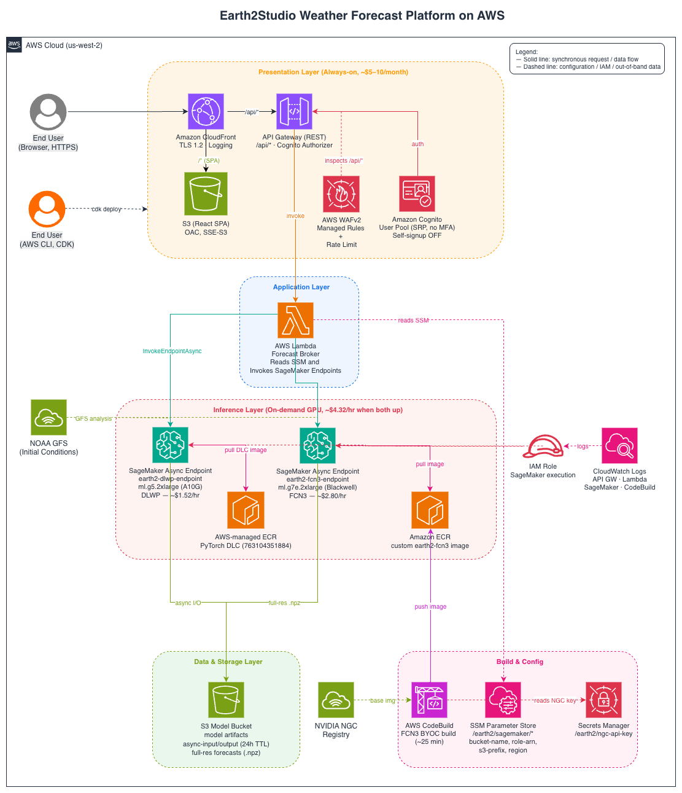
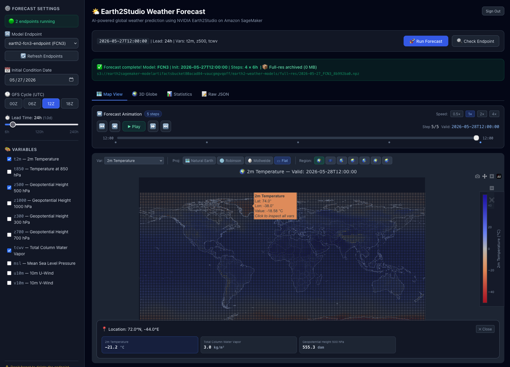

# Run your own global AI weather forecast on AWS with NVIDIA Earth2Studio, Amazon SageMaker, and AWS CDK

> **Source repository:** <https://github.com/aws-samples/sample-earth2studio-on-aws>

Accurate global weather forecasts sit underneath almost every part of the modern economy — aviation routing, energy trading, grid operations, agriculture, shipping, emergency response, insurance pricing, and the morning news all depend on knowing what the atmosphere will look like six hours, one day, or ten days from now. For roughly 50 years, the only way to produce that forecast was **Numerical Weather Prediction (NWP)** — discretizing the atmosphere into a 3-D grid and numerically solving the conservation equations of mass, momentum, and energy at every grid cell, every few seconds of simulated time, for ten simulated days. Operational NWP models such as NOAA’s **GFS**, ECMWF’s **IFS**, and the UK Met Office’s **UM** routinely cost tens of thousands of CPU-hours per forecast cycle and run on dedicated supercomputers that cost national meteorological centers hundreds of millions of dollars per year.

Then, in late 2022, a series of papers — **FourCastNet** (NVIDIA), **Pangu-Weather** (Huawei), **GraphCast** (Google DeepMind), and **FuXi** (Fudan University) — showed that machine-learning models trained on **ERA5**, a 40-year reanalysis archive of past weather, could produce 10-day global forecasts of comparable or *better* skill than traditional NWP, in **under a minute**, on a **single GPU**. Some of these models now match or beat ECMWF IFS-HRES — the world’s most accurate operational physics model — on standard skill scores like RMSE of 500 hPa geopotential height.

The catch is that these models live as PyTorch checkpoints scattered across NVIDIA NGC, GitHub, and Hugging Face, with finicky CUDA dependencies (`torch-harmonics`, `makani`, `physicsnemo`), a hard dependency on real-time initial-condition data (typically NOAA’s GFS analysis), and varying licenses. **Running them in production is non-trivial.**

In this post, we close that gap. We walk through a turnkey reference architecture — fully captured as Infrastructure as Code with the [AWS Cloud Development Kit (AWS CDK)](https://aws.amazon.com/cdk/) — that serves two open-source AI weather models from the [NVIDIA Earth2Studio](https://github.com/NVIDIA/earth2studio) framework on [Amazon SageMaker](https://aws.amazon.com/sagemaker/) asynchronous endpoints, behind a secure single-page web application protected by [Amazon CloudFront](https://aws.amazon.com/cloudfront/), [AWS WAF](https://aws.amazon.com/waf/), and [Amazon Cognito](https://aws.amazon.com/cognito/). The entire deployment runs in your own AWS account and goes from **`git clone` to first forecast in well under an hour**. Both models are licensed under Apache-2.0, and the only manual step is providing AWS credentials.

If you’ve ever wondered *“could I run my own weather forecast?”* — yes, you can. This post (and its accompanying repository) shows how.

---

## Solution overview

The following diagram shows the end-to-end architecture. The full editable diagram is available at [`docs/architecture.drawio`](docs/architecture.drawio); a rendered PNG is embedded below.



The request path, end to end:

1. A user opens the SPA URL in the browser. CloudFront serves the React bundle from S3 over TLS 1.2+.
2. When the user clicks **Run forecast**, the SPA sends the call to `https://<cloudfront>/api/*`. CloudFront forwards `/api/*` to API Gateway.
3. AWS WAFv2 evaluates the request against AWS managed rule groups and a per-IP rate limit. API Gateway then enforces the Cognito authorizer, which validates the user’s SRP-issued JWT.
4. API Gateway invokes the Lambda function. Lambda reads the SageMaker endpoint name and S3 prefix from SSM Parameter Store and calls `InvokeEndpointAsync` against the appropriate SageMaker endpoint.
5. The SageMaker endpoint pulls initial conditions from NOAA’s public GFS analysis, runs the model forward, writes the full-resolution NumPy archive to the S3 model bucket, and returns a downsampled JSON summary.
6. Lambda returns the JSON to API Gateway, which returns it through CloudFront to the SPA. The SPA renders an animated map.

The architecture uses a **hybrid lifecycle**. The presentation layer (CloudFront, Cognito, Lambda, S3 SPA, API Gateway, AWS WAFv2) is cheap and **always on** because tearing it down would invalidate the SPA URL and any users you’ve created. GPU endpoints, by contrast, cost real money, so they have to be **ephemeral**: created on demand and deleted when you’re done. AWS CDK manages the always-on layer; the `deploy-all.sh` shell script in `sagemaker_deploy/` manages the ephemeral endpoints.

---

## Table of contents

1. [Solution overview](#solution-overview)
2. [What you’ll build](#what-youll-build)
3. [Costs and performance](#costs-and-performance)
4. [Prerequisites](#prerequisites)
5. [Walkthrough](#walkthrough)
   - [Step 1 — Configure AWS credentials and region](#step-1--configure-aws-credentials-and-region)
   - [Step 2 — Clone the repository and install dependencies](#step-2--clone-the-repository-and-install-dependencies)
   - [Step 3 — Run `setup.sh`](#step-3--run-setupsh)
   - [Step 4 — Bootstrap AWS CDK](#step-4--bootstrap-aws-cdk)
   - [Step 5 — Deploy the SageMaker infrastructure stack](#step-5--deploy-the-sagemaker-infrastructure-stack)
   - [Step 6 — Build and deploy the frontend](#step-6--build-and-deploy-the-frontend)
   - [Step 7 — Create the first user and sign in](#step-7--create-the-first-user-and-sign-in)
   - [Step 8 — (Optional) Build the FCN3 BYOC container](#step-8--optional-build-the-fcn3-byoc-container)
   - [Step 9 — Deploy SageMaker endpoints](#step-9--deploy-sagemaker-endpoints)
   - [Step 10 — Run a forecast](#step-10--run-a-forecast)
6. [Configuration reference](#configuration-reference)
7. [Project structure](#project-structure)
8. [Security](#security)
9. [Cleanup](#cleanup)
10. [Local development](#local-development)
11. [Troubleshooting](#troubleshooting)
12. [Conclusion](#conclusion)
13. [Authors](#authors)
14. [License and model attribution](#license-and-model-attribution)

Deep-dive docs live alongside the main README:

- [`docs/MODELS.md`](docs/MODELS.md) — the two weather models (DLWP and FourCastNet v3), when to use each, and further reading.
- [`docs/ARCHITECTURE.md`](docs/ARCHITECTURE.md) — repository layout and a per-resource breakdown of both CDK stacks.
- [`docs/SECURITY.md`](docs/SECURITY.md) — code-level hardening and the production gaps you must resolve before going live.
- [`docs/TROUBLESHOOTING.md`](docs/TROUBLESHOOTING.md) — common symptoms, causes, and fixes.

---

## What you’ll build

By the end of this walkthrough you will have, **in your own AWS account**, a complete, production-style global weather-forecasting platform with three layers:

1. **An inference layer** — two prognostic ML models, each on its own SageMaker asynchronous-inference endpoint:
   - **DLWP** on `ml.g5.2xlarge` (24 GB A10G GPU, ~$1.52/hr) — a fast, low-resolution baseline.
   - **FCN3** (FourCastNet v3) on `ml.g7e.2xlarge` (96 GB Blackwell RTX PRO 6000 GPU, ~$2.80/hr) — operational-grade, 0.25° global, 72 atmospheric variables.
   - Both endpoints automatically fetch initial conditions from NOAA’s GFS analysis (no API key required) and return both a downsampled JSON summary for the UI and the full-resolution NumPy archive on Amazon S3 for scientists to download.
2. **An application layer** — a secured Web UI:
   - Amazon CloudFront distribution with TLS 1.2 minimum.
   - Amazon S3 for the React/Vite SPA assets.
   - Amazon API Gateway REST API protected by AWS WAFv2 (managed rules + per-IP rate limiting).
   - AWS Lambda (Python 3.13) brokering all SageMaker calls.
   - Amazon Cognito for user authentication (email + password, SRP-only, no MFA, **self-signup disabled** — admins create users via the AWS Command Line Interface).
3. **An infrastructure layer** — two AWS CDK stacks that pass [CDK Nag](https://github.com/cdklabs/cdk-nag)’s `AwsSolutions` rule pack:
   - **`Earth2SageMaker`**: S3 bucket (with lifecycle cleanup), least-privilege AWS Identity and Access Management (IAM) execution role, Amazon Elastic Container Registry (Amazon ECR) repository, AWS CodeBuild project, and AWS Systems Manager Parameter Store entries that everything else auto-discovers.
   - **`Earth2UI`**: Cognito User Pool, AWS WAFv2 Web ACL, S3 SPA bucket, API Gateway, Lambda function, and the CloudFront distribution.

A small `setup.sh` script does the only manual step: storing the NVIDIA NGC API key in AWS Secrets Manager so AWS CodeBuild can `docker login nvcr.io` and pull the FCN3 base image.

A user signs in to the SPA, picks a model and an initial date, chooses which variables to plot (for example `t2m`, `z500`, `msl`), clicks **Run forecast**, and 10–60 seconds later sees animated maps of the forecast.

The screenshot below shows the web UI (the React single-page application served by CloudFront) after a successful FCN3 forecast run — the sidebar on the left drives the model, init date, lead time, and variable selection, while the main panel renders the animated global forecast maps and per-variable statistics:



> *Demo screenshot — included for illustration only. The exact look-and-feel of your deployment may evolve as you customize the React/Vite frontend in `frontend/`.*

> **The pitch in one sentence:** *“Run `cdk deploy` and `./deploy-all.sh`, wait fifteen minutes, and you have a global AI weather-forecasting service running in your own AWS account, behind your own login, with end-to-end encryption, AWS WAF protection, and a clean web UI to drive it.”*

**Total time to deploy from a fresh AWS account: ~40 minutes**, of which roughly 30 are AWS provisioning (CloudFront propagation + GPU endpoint warm-up).

> **The two models:** the repo ships two Apache-2.0 models — **DLWP** (fast 1.0° baseline on an A10G GPU) and **FCN3 / FourCastNet v3** (operational-grade 0.25° on a Blackwell GPU). For architecture details, when to use each, and further reading, see [`docs/MODELS.md`](docs/MODELS.md).

---

## Costs and performance

There are two cost lines to track:

| Resource | Cost | Lifecycle |
|---|---|---|
| **CDK long-lived infra** (CloudFront, Lambda, S3, Cognito, AWS WAF, API Gateway) | **~$5–10 / month** total | Always on |
| **DLWP endpoint** (`ml.g5.2xlarge`) | **~$1.52 / hr** | On-demand only |
| **FCN3 endpoint** (`ml.g7e.2xlarge`) | **~$2.80 / hr** | On-demand only |
| **Combined (both endpoints up)** | **~$4.32 / hr ≈ $104 / day** | On-demand only |

> ⚠️ **GPU endpoints are billed per second they exist, not per inference call.** A SageMaker async endpoint with 0 % utilization still costs you the full hourly rate. Always run `./deploy-all.sh --delete` when you’re done experimenting.

Inference latency from a warm endpoint:

| Model | 24 h forecast (3 vars) | 240 h forecast (10 days, all vars) |
|---|---|---|
| DLWP | ~10 sec | ~30–60 sec |
| FCN3 | ~30 sec | ~3–5 min |

The first inference after endpoint creation is slower (~1–3 min) because the model weights are downloaded from NVIDIA’s registry into the container’s `/tmp` cache. Subsequent calls are fast.

---

## Prerequisites

You need the following installed locally **before** you start the walkthrough:

| Tool | Version | Install |
|---|---|---|
| AWS CLI v2 | latest | <https://aws.amazon.com/cli/> |
| Node.js | ≥ 18 | <https://nodejs.org/> |
| Python | ≥ 3.13 | <https://www.python.org/downloads/> |
| AWS CDK CLI | latest | `npm install -g aws-cdk` |
| Docker (optional) | latest | only for local container builds; AWS CodeBuild handles cloud builds |

You also need:

- An **AWS account** you own or have admin access to (the deploy creates IAM roles, S3 buckets, ECR repositories, CloudFront distributions, and so on).
- An **NVIDIA NGC API key** if (and only if) you intend to deploy the FCN3 model using the **NGC** container variant. The DLC variant works without one.

### Getting an NGC API key

Skip this section if you’ll only use the FCN3 **DLC** variant or none of the FCN3 endpoints at all.

1. Visit <https://ngc.nvidia.com/setup/api-key> and sign in with a free NVIDIA account.
2. Choose **Generate API Key** → **Confirm**.
3. Copy the key — it starts with `nvapi-…`. You won’t see it again, so save it now.

The `setup.sh` script (described in the next section) puts this key into AWS Secrets Manager at `/earth2/ngc-api-key`. The CDK stack and the FCN3 CodeBuild project read it from there. The key never gets committed to the repo.

---

## Walkthrough

This section is a full deploy-from-zero runbook. Each step is independent and verifiable — if something fails, the troubleshooting hint at the end of the step (or the [Troubleshooting](#troubleshooting) table at the end of the post) tells you what to check.

### Step 1 — Configure AWS credentials and region

The whole project picks up AWS account and region from the **standard AWS CLI configuration**. Nothing in this repo hardcodes either.

Edit (or create) `~/.aws/credentials`:

```ini
[default]
aws_access_key_id     = AKIA...
aws_secret_access_key = ...
# aws_session_token = ...   # only for temporary creds (SSO, STS, Isengard, etc.)
```

Edit (or create) `~/.aws/config`:

```ini
[default]
region = us-west-2
output = json
```

> **A note about config-file syntax:** the **default** profile uses the bare header `[default]` in *both* files. Other profiles use `[NAME]` in `credentials` but `[profile NAME]` in `config`. The region key is lowercase `region =`, not `AWS_REGION =`.

Verify both work:

```bash
aws sts get-caller-identity   # → prints your Account, UserId, Arn
aws configure get region      # → prints your region (e.g. us-west-2)
```

If either command fails, fix that first. AWS CDK will fail with `UnresolvedAccount` or `NoCredentials` until both succeed.

### Step 2 — Clone the repository and install dependencies

```bash
git clone https://github.com/aws-samples/sample-earth2studio-on-aws.git
cd sample-earth2studio-on-aws

# Python virtualenv for CDK
python3 -m venv .venv
source .venv/bin/activate
pip install -r requirements-cdk.txt

# Node.js dependencies for the React frontend.
# The first `npm run build` is required because the CDK app references
# `frontend/dist/` as a deployment asset; every `cdk` command (bootstrap,
# synth, diff, deploy) fails at app-load time if that directory does not
# exist. Step 6 rebuilds it later with the real Cognito IDs.
cd frontend && npm install && npm run build && cd ..
```

### Step 3 — Run `setup.sh`

`setup.sh` does two things:

1. Validates AWS credentials and prints the account and region you’re about to deploy into. **Read this carefully** — if it shows the wrong account, fix your AWS profile before continuing.
2. Stores your NGC API key in Secrets Manager at `/earth2/ngc-api-key` (skip with `Ctrl-C` if you don’t have a key).

Run it **once per AWS account** before the first `cdk deploy`. There are three ways to invoke it:

```bash
# A. Interactive — script prompts for the NGC key (recommended for first-time setup)
./setup.sh

# B. Non-interactive — supply the key via env var (CI / repeat setups)
NGC_API_KEY=nvapi-xxxxxxxxxxxxxxxxxx ./setup.sh

# C. Credentials check only — does NOT write anything to Secrets Manager
./setup.sh --check-only
```

If the secret already exists, the script asks before overwriting. To target a different profile or region, set them first:

```bash
AWS_PROFILE=my-sandbox AWS_REGION=us-east-1 ./setup.sh
```

### Step 4 — Bootstrap AWS CDK

AWS CDK needs a small set of staging resources (an S3 bucket, ECR repository, IAM roles) in the target account+region before any stack can deploy. This is a one-time operation per **account + region** combination.

```bash
npx cdk bootstrap
```

Verify:

```bash
aws cloudformation describe-stacks --stack-name CDKToolkit \
  --query 'Stacks[0].StackStatus' --output text
# → CREATE_COMPLETE  or  UPDATE_COMPLETE
```

### Step 5 — Deploy the SageMaker infrastructure stack

This creates the long-lived resources that all SageMaker endpoints share: the model bucket, the IAM execution role, the FCN3 ECR repository, the CodeBuild project, and the SSM parameters that every other component reads.

```bash
npx cdk deploy Earth2SageMaker --require-approval never
```

You’ll see outputs like the following (the random suffixes will differ for you — write them down):

```
Earth2SageMaker.ModelBucketName  = earth2sagemaker-modelartifactsbucket80acad84-<random>
Earth2SageMaker.SageMakerRoleArn = arn:aws:iam::<account>:role/earth2-sagemaker-execution-role
Earth2SageMaker.SSMPrefix        = /earth2/sagemaker
```

Verify auto-discovery is wired up:

```bash
for p in bucket-name s3-prefix role-arn region; do
  echo "$p = $(aws ssm get-parameter --name /earth2/sagemaker/$p --query Parameter.Value --output text)"
done
```

> **Troubleshooting**: if you see `NoCredentials: Need to perform AWS calls for account ..., but no credentials have been configured` from `npx`, your credentials aren’t propagating. Run `eval "$(aws configure export-credentials --format env)"` and re-issue the deploy.

### Step 6 — Build and deploy the frontend

The React SPA needs the Cognito User Pool ID and Client ID **before** it can be built. Those values come from the *Earth2UI* stack outputs, which you haven’t deployed yet — chicken-and-egg. The workaround is a two-pass build.

**Pass 1 — deploy `Earth2UI` once with the placeholder bundle** so Cognito gets created:

```bash
cp frontend/.env.local.example frontend/.env.local
# Leave the placeholders for now — we'll fix them in Pass 2.
cd frontend && npm run build && cd ..
npx cdk deploy Earth2UI --require-approval never
```

Capture the outputs:

```
Earth2UI.UserPoolId       = us-west-2_XXXXXXXXX
Earth2UI.UserPoolClientId = XXXXXXXXXXXXXXXXXXXXXXXXXX
Earth2UI.CloudFrontURL    = https://XXXXXXXXXX.cloudfront.net
Earth2UI.ApiURL           = https://XXXXXXXXXX.execute-api.<region>.amazonaws.com/prod/
```

**Pass 2 — rebuild the frontend with the real Cognito IDs**:

```bash
# Edit frontend/.env.local with the values from above:
#   VITE_DEV_MODE=false
#   VITE_USER_POOL_ID=us-west-2_XXXXXXXXX
#   VITE_USER_POOL_CLIENT_ID=XXXXXXXXXXXXXXXXXXXXXXXXXX

cd frontend && npm run build && cd ..
npx cdk deploy Earth2UI --require-approval never
```

CDK detects the changed `frontend/dist/` asset, pushes it to S3, and invalidates CloudFront automatically. This second deploy is fast (~2 min).

> **Troubleshooting**: if the SPA loads but auth fails with “User pool client … does not exist”, the bundle was built with stale IDs. Recheck `frontend/.env.local` and rerun Pass 2.

### Step 7 — Create the first user and sign in

Open the CloudFront URL in a browser:

```
https://<your-cloudfront-id>.cloudfront.net
```

You should see a sign-in page. **Self-signup is disabled** at the Cognito User Pool level — administrators must provision users explicitly. Create the first user from the AWS CLI:

```bash
USER_POOL_ID=$(aws cloudformation describe-stacks --stack-name Earth2UI \
  --query 'Stacks[0].Outputs[?OutputKey==`UserPoolId`].OutputValue' --output text)

# 1. Create the user. Pass the email as --username; Cognito assigns an
#    internal UUID and uses the email as the sign-in alias (because the
#    pool was configured with sign_in_aliases=email).
aws cognito-idp admin-create-user \
  --user-pool-id "$USER_POOL_ID" \
  --username you@example.com \
  --user-attributes Name=email,Value=you@example.com Name=email_verified,Value=true \
  --message-action SUPPRESS \
  --temporary-password 'TempPass!1234'

# 2. Promote the password to permanent so the user doesn't get a
#    NEW_PASSWORD_REQUIRED challenge on first sign-in.
aws cognito-idp admin-set-user-password \
  --user-pool-id "$USER_POOL_ID" \
  --username you@example.com \
  --password 'YourRealStrongPassword!1' \
  --permanent
```

The password must satisfy: **min 8 chars, upper + lower + digit + symbol**. A common gotcha is a password like `password@1234567890` — it lacks an uppercase letter and Cognito will reject it with `InvalidPasswordException`.

Now sign in to the SPA with those credentials. You’ll land on the main dashboard. The SageMaker endpoints list will be empty until Step 9.

> **Pool quirk to know:** this stack sets `sign_in_aliases=email`, which Cognito implements as `UsernameAttributes=["email"]`. That means the email *is* the username — `admin-get-user` will show a UUID in the `Username` field, but you reference the user by email everywhere. To list users:
> ```bash
> aws cognito-idp list-users --user-pool-id "$USER_POOL_ID" \
>   --query 'Users[].[Username,UserStatus,Attributes[?Name==`email`]|[0].Value]' --output table
> ```
> To remove a user: `aws cognito-idp admin-delete-user --user-pool-id "$USER_POOL_ID" --username you@example.com`.

### Step 8 — (Optional) Build the FCN3 BYOC container

> **Heads-up before skipping:** the default Step 9 command — `./deploy-all.sh` — deploys **both** DLWP **and** FCN3, and the FCN3 deploy will fail if the BYOC image isn't built first. If you want to skip the FCN3 BYOC build, either deploy DLWP only (`python deploy.py --model dlwp`) or use the alternative `dlc` variant (`python deploy.py --model fcn3 --container-variant dlc`), which is built from a public AWS DLC and does **not** require an NGC API key. The standalone `deploy-all.sh --variant dlc` flag also works.

Skip this step if you only plan to use DLWP, which runs on the standard AWS-managed PyTorch DLC. FCN3 needs a custom container because:

1. PyTorch 2.6 (latest SageMaker inference DLC) doesn’t support Blackwell GPUs (`sm_120`).
2. FCN3 needs `torch-harmonics` + `makani`, which aren’t in standard DLCs.

Two BYOC variants exist (both run on `ml.g7e.2xlarge` Blackwell):

| | NGC (`container_fcn3/`) | Training DLC (`container_fcn3_dlc/`) |
|---|---|---|
| Base image | `nvcr.io/nvidia/pytorch:25.12-py3` | `pytorch-training:2.7.1-gpu-py312-cu128` |
| `torch-harmonics` | CUDA-compiled (faster) | PyPI wheel (float32 fallback) |
| Needs NGC key | yes (Secrets Manager) | no |
| Image size | ~15-20 GB | ~10-12 GB |

Build the **NGC** variant (the default):

```bash
BUCKET=$(aws ssm get-parameter --name /earth2/sagemaker/bucket-name --query Parameter.Value --output text)

# Zip the repo source (CodeBuild reads from S3, not GitHub)
zip -rq /tmp/fcn3-source.zip . \
  -x '.git/*' 'node_modules/*' 'frontend/node_modules/*' \
     '.venv/*' '__pycache__/*' '*/__pycache__/*' \
     'frontend/dist/*' 'cdk.out/*' \
     '.env' 'frontend/.env.local'

aws s3 cp /tmp/fcn3-source.zip s3://$BUCKET/codebuild/fcn3-source.zip
aws codebuild start-build --project-name earth2-fcn3-container-build
```

CodeBuild takes **~25–30 minutes** (the CUDA compile of `torch-harmonics` is the slow part). Monitor:

```bash
BUILD_ID=$(aws codebuild list-builds-for-project --project-name earth2-fcn3-container-build \
  --query 'ids[0]' --output text)
aws codebuild batch-get-builds --ids $BUILD_ID \
  --query 'builds[0].{Phase:currentPhase,Status:buildStatus}' --output table

aws logs tail /aws/codebuild/earth2-fcn3-container-build --follow
```

When complete, the image is at `<account>.dkr.ecr.<region>.amazonaws.com/earth2-fcn3:latest`.

### Step 9 — Deploy SageMaker endpoints

⚠️ **GPU instances are expensive — about $4.32/hr if both endpoints are running.** Always run `--delete` when you’re done.

```bash
cd sagemaker_deploy

# Deploy both default models (DLWP + FCN3-NGC)
./deploy-all.sh

# Or deploy a single model
python deploy.py --model dlwp --no-wait
python deploy.py --model fcn3 --container-variant ngc --no-wait
python deploy.py --model fcn3 --container-variant dlc --no-wait

# Check status
./deploy-all.sh --status

# Stop billing — delete all earth2-* endpoints
./deploy-all.sh --delete
```

A single endpoint takes 5–15 min to reach `InService`. The frontend’s `/api/endpoints` route auto-discovers them and shows them in the UI.

### Step 10 — Run a forecast

In the browser SPA:

1. Choose a model from the sidebar (DLWP or FCN3).
2. Pick an initial date (defaults to the most recent GFS analysis cycle).
3. Choose a lead time (24–240 hours).
4. Choose variables to plot (for example, `t2m`, `z500`, `msl`).
5. Choose **Run forecast**. The first call fetches GFS initial conditions (~30 sec) then runs the model (10–60 sec depending on model + lead time).

Or via the CLI:

```bash
python sagemaker_deploy/invoke_endpoint.py \
  --endpoint-name earth2-fcn3-endpoint \
  --date 2026-05-19T00:00:00 \
  --lead-time-hours 24 \
  --variables t2m z500 msl u10m v10m \
  --verbose
```

A sample successful FCN3 output:

```
======================================================================
  🌤️  WEATHER FORECAST RESULTS
======================================================================
  Model:           FCN3
  Init Time:       2026-05-19T00:00:00
  Lead Time:       24 hours (1.0 days)
  Steps:           4 × 6.0h
  Valid From:      2026-05-19T00:00:00
  Valid To:        2026-05-20T00:00:00

  Variable     Unit                Min         Mean          Max          Std
  ------------ ---------- ------------ ------------ ------------ ------------
  msl          hPa               949.1       1011.0       1069.0         11.8
  t2m          °C               -72.04         6.80        47.79        21.57
  z500         m²/s²         4.683e+04    5.437e+04    5.835e+04         3260

  Total variables: 3
  Data shape:      [1, 5, 721, 1440]
======================================================================
```

These are the **global statistics** at `2026-05-20T00:00:00 UTC` — that is, across all 721 × 1440 grid cells: a global mean temperature of 6.80 °C and a mean sea-level pressure (`msl`) range from 949 hPa (a deep extratropical low somewhere) to 1069 hPa (an intense Siberian high) — which is exactly what you’d expect for late May. Use the SPA or load `full_res_s3` to see *where* on the globe these extremes are.

---

## Configuration reference

This project does **not** require editing source files for account / region / bucket. The resolution order at deploy time is:

| Resource | Source |
|---|---|
| AWS account / region | `~/.aws/credentials` + `~/.aws/config` (via `CDK_DEFAULT_*` env vars). Override with `cdk -c account=… -c region=…`. |
| S3 model bucket | SSM `/earth2/sagemaker/bucket-name` (created by `Earth2SageMaker`). Override with `EARTH2_S3_BUCKET`. |
| SageMaker IAM role | SSM `/earth2/sagemaker/role-arn`. Override with `EARTH2_SAGEMAKER_ROLE`. |
| ECR image URI | Built dynamically from caller account + region + repo name. |
| Cognito User Pool / Client IDs | `frontend/.env.local` (copy from `.env.local.example`, fill from `Earth2UI` outputs). |
| NGC API key (FCN3 NGC only) | Secrets Manager `/earth2/ngc-api-key` (provisioned by `setup.sh`). |

---

## Project structure

The repository layout and a per-resource breakdown of both CDK stacks (`Earth2SageMaker` and `Earth2UI`) are documented in [`docs/ARCHITECTURE.md`](docs/ARCHITECTURE.md).

---

## Security

> ⚠️ **Read this before you deploy to anything beyond a sandbox.** This is a sample, not a production-certified workload. The infrastructure ships with strong defaults, but the two BYOC containers run as `root` and pin to base images that age — both are real hardening items you **must** resolve before a regulated or production deployment. Details and remediation steps are in [`docs/SECURITY.md`](docs/SECURITY.md).

All infrastructure passes the **CDK Nag `AwsSolutions`** rule pack:

- Cognito authentication on all API endpoints, **self-signup disabled** (admin-create-user only — addresses Palisade `SelfRegistrationEnabledAWS`).
- AWS WAFv2 with AWS managed rules + per-IP rate limiting.
- Least-privilege IAM (scoped to `earth2-*` endpoints + specific S3 prefixes).
- S3 SSE-S3 + enforced SSL + blocked public access + access logging.
- CloudFront TLS 1.2 minimum.
- API Gateway access logging + request validation.

**Code-level hardening** — every high-severity finding from the static-analysis tooling (Bandit, Semgrep, Checkov, ASH) is either fixed in code or documented inline next to the relevant line. **Known production gaps** — `root` containers and base-image freshness are deliberately left for you to resolve when you fork, with compensating controls explained. Both are documented in full in [`docs/SECURITY.md`](docs/SECURITY.md).

---


## Cleanup

⚠️ **SageMaker endpoints are expensive GPU instances. Always delete them when you’re done.**

```bash
cd sagemaker_deploy
./deploy-all.sh --status    # See what's running
./deploy-all.sh --delete    # Stop billing immediately
```

| Resource | Cost | Lifecycle |
|---|---|---|
| CDK infrastructure (CloudFront, Lambda, S3, etc.) | ~$5–10 / month | Always on (minimal) |
| SageMaker endpoints (DLWP + FCN3) | **~$4.32 / hr** | On-demand only |

`./deploy-all.sh --delete` removes the SageMaker endpoints; the rest of the infra (S3 bucket, Cognito, CloudFront) keeps running cheaply. To take everything down, destroy the stacks in **reverse order** of creation, because `Earth2UI` imports the model bucket from `Earth2SageMaker`:

```bash
# 1. Stop any SageMaker endpoints (do this first to halt GPU charges)
cd sagemaker_deploy && ./deploy-all.sh --delete && cd ..

# 2. Destroy the UI stack (CloudFront takes 5–15 min to disable + delete)
npx cdk destroy Earth2UI --force

# 3. Destroy the SageMaker infra stack (purges S3 + ECR images via auto_delete)
npx cdk destroy Earth2SageMaker --force
```

The NGC secret in Secrets Manager is **not** managed by AWS CDK and survives teardown. To remove it:

```bash
aws secretsmanager delete-secret --secret-id /earth2/ngc-api-key \
  --force-delete-without-recovery
```

---

## Local development

```bash
# Frontend dev server (Vite, hot-reload). Proxies /api/* to backend port 3001.
cd frontend && npm run dev

# Backend local server — wraps the Lambda handler in Flask.
# Requires S3_BUCKET set; quickest way is to source it from SSM:
export AWS_REGION=us-west-2
export S3_BUCKET=$(aws ssm get-parameter --name /earth2/sagemaker/bucket-name \
  --query Parameter.Value --output text)
cd backend && python local_server.py

# CDK diff and synth (preview changes without deploying)
npx cdk diff
npx cdk synth
```

---

## Troubleshooting

Common symptoms, causes, and fixes are collected in [`docs/TROUBLESHOOTING.md`](docs/TROUBLESHOOTING.md).

---

## Conclusion

In this post we showed how to take two open-source AI weather models — DLWP and FourCastNet v3 — and deliver them as a secure, multi-tenant, production-style web application running entirely on AWS. The same `cdk deploy` and `./deploy-all.sh` workflow gets you from an empty AWS account to a global AI weather forecast in under an hour, for less than $10 per month of always-on infrastructure plus on-demand GPU time you can switch off when you’re done.

The same pattern — long-lived presentation infrastructure provisioned by AWS CDK in front of ephemeral GPU inference managed by a script — generalizes well beyond weather. If you have any other large open-source model that needs an A10G or Blackwell GPU and an authenticated UI, you can fork this repository, swap out the inference handler, and reuse essentially everything else.

We’d love to see what you build with it.

---

## Authors

This sample was built and is maintained by:

- **Dinesh Mane** — Applied Scientist, AWS
- **Satheesh Maheswaran** — HPC Specialist, AWS

---

## License and model attribution

The code in this repository is licensed under [MIT-0](LICENSE) — the AWS Samples standard permissive license. See [`LICENSE`](LICENSE) for the full text.

The two weather models packaged here both carry permissive **Apache-2.0** licenses. Each model’s weights are downloaded at container start time from NVIDIA’s model registry and bundled into the running endpoint, so the Apache-2.0 license terms apply to your use of the resulting forecasts.

| Model | Origin | License | Source |
|---|---|---|---|
| **DLWP** | University of Washington (Karlbauer et al.), packaged via NVIDIA Earth2Studio | Apache-2.0 | <https://github.com/NVIDIA/earth2studio/blob/main/earth2studio/models/px/dlwp.py> |
| **FCN3** (FourCastNet v3) | NVIDIA, packaged via NVIDIA Earth2Studio | Apache-2.0 | <https://github.com/NVIDIA/earth2studio/blob/main/earth2studio/models/px/fcn3.py> |

**Why only these two?** Other models exposed by `earth2studio` (Pangu-Weather from Huawei, GraphCast from Google DeepMind, FuXi from Fudan University, etc.) carry research-only / non-commercial / CC-BY-NC licenses that are incompatible with publication under aws-samples without per-model legal review. They are intentionally not registered in `sagemaker_deploy/config.py`. If you need them for an internal or research deployment, you can add them back to your fork — but verify each model’s license against your use case first.

The NVIDIA Earth2Studio framework itself: <https://github.com/NVIDIA/earth2studio> (Apache-2.0).

**Further reading** — model architecture details, when to use each model, and links to the original AI-weather papers and datasets (GFS, ERA5, WeatherBench 2) are in [`docs/MODELS.md`](docs/MODELS.md).
